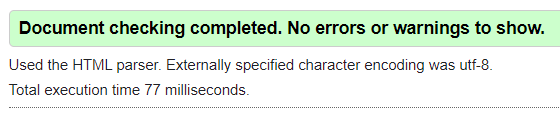
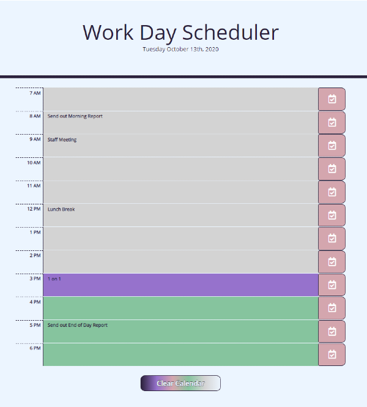

# [**05-work-day-scheduler**](https://michellemcconville.github.io/05-work-day-scheduler/) 🔗

## Customer Request

For this project the customer request we:

Create a simple `Daily Work Planner` app which:

- Displays the `Current Date` at the top
- Presents `Hourly` time blocks for business day
- For each time block the ability to:
  - `Create` new tasks
  - `Save` tasks into local storage
  - `Change/Update` tasks
  - `Keep` tasks after page is refreshed
- Color coding time blocks for:
  - ***`Past`***
  - ***`Present`***
  - ***`Future`***
  
---

## ***Site***

This planner used customer provided code as starter

### ***HTM*** `|` [**work-day-scheduler**](https://michellemcconville.github.io/05-work-day-scheduler/) 🔗

#### 1. Used the client provided ***`index.html`*** file with the following

- All the `<meta>`, stylesheet `<links>` & `<script>` files and/or libraries necessary
- Added a `clearBtn` to clear all calendar tasks
- Added the following `code` block per time block
  - `
` with `.row` & `time-block`
  - `
` with `.col` & `hour` & hour ID
  - `<textarea>` with `.col` & `description` & hour ID
  - `<button>` with `.col` & `saveBtn` & hour ID

### ***CSS***

#### 2. Used the client provided ***`style.css`*** file with the following

- Added the [html5doctor.com Reset Style Sheet](http://html5doctor.com/) by [Richard Clark](http://richclarkdesign.com)
- Updated css existing styles based on new coloring
- Added new css for `clear calendar` button styling
- Create the following groups:
  - *`Global, Classes, Colors, Buttons & @Media`*

### ***JS***

#### 3. Newly created ***`script.js`*** file with the following

- List of **`variables`** which includes moment.js **`Date`**
- List of **`eventListeners`**
- List of **`functions`**
  - *`timeHighlight f(x):`* Sets the coloring based on time block
  - *`saveBtn f(x):`* Save button which triggers setItem
  - *`setItem:`* Saves and/or updates tasks into local storage
  - *`getItem:`* Pulls saved tasks from local storage
  - *`onClick:`* Button to clear all time block tasks

---

## Sources Referenced

[google](https://www.google.com/) **`|`**
[momentJs](https://momentjs.com/) **`|`**
[w3schools](https://www.w3schools.com) **`|`**
[MDN web docs](https://developer.mozilla.org/en-US/) **`|`**
[Markdown Guide](https://www.markdownguide.org/)

---

## Accessibility Standards Validation

| Successfully ran code thru [**W3C**](https://validator.w3.org/) validator |
|---------------------------------------------------------------------------|
|                         |

---

## Output for Review

Submitted the following for review:

- The URL of the deployed application
- The URL of the GitHub repository. (**README.md** included)

---

## Application Screenshots

